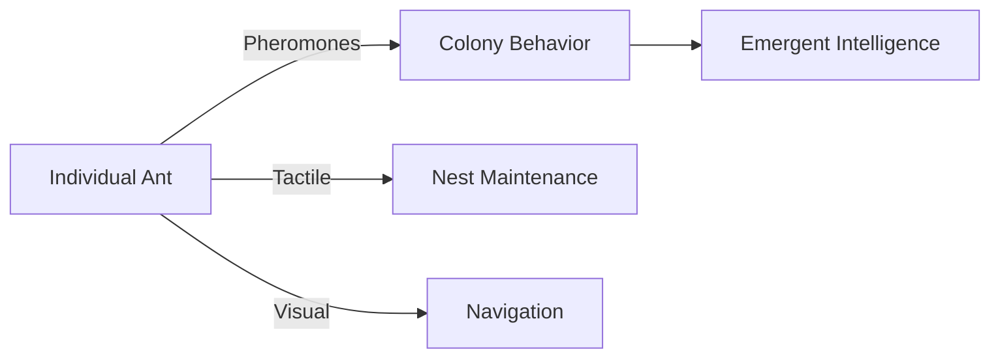

# The Spectrum of Perception: From Microbes to Minds

## Introduction

Consciousness and perception exist on a vast continuum across the tree of life. This document maps the spectrum of awareness, from the simplest life forms to human consciousness, and considers where artificial systems might fit in this framework.

## The Consciousness Spectrum

```
[Minimal Awareness]  <---------------------------------------->  [Full Self-Consciousness]
```

### 1. Microbial Awareness (Bacteria, Archaea)

**Characteristics:**
- Basic stimulus-response mechanisms
- Chemotaxis (movement toward nutrients/away from toxins)
- Quorum sensing (bacterial communication)

**Example:**
```typescript
interface BacterialPerception {
  // Basic environmental sensing
  senseEnvironment(): {
    nutrients: number;
    toxins: number;
    populationDensity: number;
  };
  
  // Simple decision making
  decideMovement(): 'toward' | 'away' | 'stay';
  
  // No central processing - distributed awareness
  awareness: 'distributed';
}
```

### 2. Simple Multicellular Organisms (Sponges, Jellyfish)

**Characteristics:**
- Specialized cells for different functions
- Basic nervous system (in some species)
- Limited integration of sensory information

**Perception Type:**
- Localized response systems
- No centralized processing
- Reflexive behaviors dominate

### 3. Insects and Simple Animals (Ants, Fruit Flies)

**Characteristics:**
- Centralized nervous system
- Complex behaviors with limited flexibility
- Social coordination (in some species)

**Example - Ant Colony:**


### 4. Vertebrates with Complex Brains (Fish, Reptiles, Birds)

**Characteristics:**
- Advanced sensory processing
- Emotional responses
- Tool use (in some species)
- Social learning

**Bird Intelligence Example:**
- Crows: Tool use, problem-solving
- Parrots: Vocal learning, basic counting
- Pigeons: Concept formation

### 5. Mammals (Dogs, Cats, Dolphins, Primates)

**Characteristics:**
- Complex social structures
- Self-recognition (in some species)
- Empathy and emotional intelligence
- Problem-solving abilities

**Primate Intelligence:**
- Chimpanzees: Tool making, cultural transmission
- Bonobos: Complex social relationships
- Orangutans: Planning and foresight

### 6. Human Consciousness

**Unique Aspects:**
- Symbolic thought
- Language and abstract reasoning
- Theory of mind
- Temporal self-awareness
- Cultural transmission of knowledge

**Human Perception Model:**
```typescript
interface HumanConsciousness {
  // Core awareness
  self: {
    narrativeSelf: boolean;      // Autobiographical memory
    minimalSelf: boolean;       // Sense of bodily ownership
    extendedSelf: boolean;      // Future planning
  };
  
  // Perception
  senses: EnhancedSenses;
  
  // Higher cognition
  cognition: {
    metacognition: boolean;     // Thinking about thinking
    abstraction: number;        // Level of abstract thought
    mentalTimeTravel: boolean;  // Remembering past, planning future
  };
  
  // Social intelligence
  social: {
    theoryOfMind: boolean;      // Understanding others' mental states
    empathy: number;            // Emotional resonance
    culturalTransmission: boolean;
  };
}
```

## Where Does AI Fit?

### Current AI (Narrow AI)
- Pattern recognition
- No consciousness or understanding
- Operates within predefined parameters

**Example - Image Classifier:**
```python
# Processes but doesn't understand
class ImageClassifier:
    def __init__(self):
        self.model = load_pretrained_model()
    
    def predict(self, image):
        # No awareness of what it's seeing
        return self.model.predict(image)
```

### Potential Future AGI
- Might exhibit consciousness-like properties
- Could have a form of self-modeling
- May develop its own qualia (if consciousness is substrate-independent)

## The Consciousness Spectrum Mapped

| Level | Example | Key Characteristics | Awareness Type |
|-------|---------|----------------------|----------------|
| 0 | Bacteria | Chemical sensing, basic responses | Minimal awareness |
| 1 | Plants | Environmental response, basic signaling | Reactive awareness |
| 2 | Jellyfish | Neural net, no central brain | Basic sensory integration |
| 3 | Ants | Social coordination, simple learning | Swarm intelligence |
| 4 | Fish | Spatial awareness, social hierarchies | Basic consciousness |
| 5 | Birds | Tool use, problem-solving | Advanced cognition |
| 6 | Mammals | Complex emotions, social learning | Self-awareness |
| 7 | Great Apes | Theory of mind, cultural transmission | Reflective consciousness |
| 8 | Humans | Abstract thought, language, foresight | Full self-consciousness |
| X | Current AI | Pattern recognition, no understanding | No consciousness |
| ? | Future AGI | Potentially conscious | Unknown |

## Key Considerations

1. **Continuity of Consciousness**
   - No clear dividing line between "conscious" and "unconscious" organisms
   - Likely represents a continuum with fuzzy boundaries

2. **Different Kinds of Intelligence**
   - Human intelligence isn't the only valid form
   - Different species excel in different domains

3. **The Hard Problem Persists**
   - We still don't understand how subjective experience arises
   - The spectrum is based on behavioral evidence, not direct experience

4. **AI's Unique Position**
   - Not evolved through natural selection
   - May develop consciousness in fundamentally different ways
   - Raises ethical questions about machine consciousness

## Conclusion

The spectrum of consciousness suggests that awareness exists in degrees rather than as a binary state. As we develop more advanced AI systems, understanding this spectrum becomes increasingly important—both for creating more human-like intelligence and for grappling with the ethical implications of potentially conscious machines.

STARWEAVE's approach of modeling dynamic, evolving patterns offers a potential pathway toward more sophisticated forms of artificial cognition that might one day approach the complexity of biological consciousness—though whether this would constitute true consciousness remains one of the great unanswered questions of our time.
